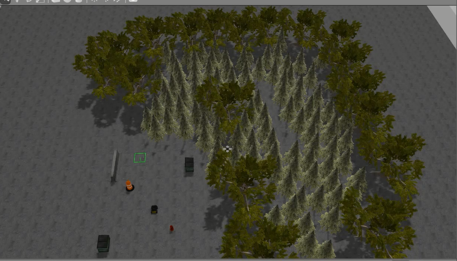

# Heterogeneous Team ROS-Gazebo Simulation Package

## Istanbul Technical University Laboratory
The purpose of this package is to simulate heterogeneous robot team (an aerial and a ground vehicle) in Gazebo, achieve multi-map merging from different view point and apply a senario for exploration. Lastly, while implementing the heterogeneous team in real life,  slightly different techniques of registiration and map merging are used.


### Dependencies
This ROS package  also includes other packages. 
Before building this package, you should install these packages: 

```
ros-kinetic-hector-pose-estimatition 
ros-kinetic-hector-uav-msg
ros-kinetic-hardware-interface
ros-kinetic-controller-interface
ros-kinetic-move-base
ros-kinetic-robot-localization
ros-kinetic-hector-gazebo-plugins 
ros-kinetic-hector-sensor-description
ros-kinetic-gazebo-ros-control
ros-kinetic-message-to-tf
ros-kinetic-interactive-marker-twist-server
ros-kinetic-twist-mux
ros-kinetic-dwa-local-planner
ros-kinetic-octomap-server 
ros-kinetic-joint-State-controller
ros-kinetic-diff-drive-controller
ros-kinetic-velodyne-gazebo-plugin
```
If gazebo wont open, you also need to install "palm_tree" , "oak_tree", "construction_barel", "fire hydrant", "asphalt_plane", "dumpster", "jersey_barrier" models from Gazebo. 

For cmake , minimum requirement is 3.03 . If you need to upgrade the CMake, you can follow this instructions from  [link](https://askubuntu.com/questions/610291/how-to-install-cmake-3-2-on-ubuntu)

### cloud_metric
includes calculation of cloud performance(quality) and occupancy metric, for more information you can check our article
### hector_quadrotor/all:
including the controller, pose estimation, mesh, urdf and xacro files of hector quadrotor drone
### hetero_demo
includes launch files to execute simulation
### hetero_gazebo_world:
includes woodland based simulation environment
### hetero_mapping:
Includes 3D map merging framework
### hetero_navigation:
UGV and UAV 's individual 2D path planners (move_base)
## hetero_teleop
includes manual control of individual robots using keyboard in simulation 
### hetero_waypoint:
sens GPS based waypoints both UGV and UAV
### husky/all:
including husky controller, mesh, urdf and xacro files of husky ground vehicle


### Simulated-World Implementation

3D collabortive mapping, exploration according to GPS waypoints,  autonomous navigation in unknown woodland environment using a ground vehicle and drone.

* Open first terminal; executes gazebo simulation, localization nodes, husky ugv (HUSKY) and hector uav (HECTOR QUADROTOR).

```
roslaunch hetero_demo outdoor_gazebo.launch 
```

* Open second terminal; Opens move base 2D navigation package for both robots.Also open the atittude controller for air vehicle

```
roslaunch hetero_navigation move_base_all.launch 
```


* Open third terminal;  Executes an exploration senario. The senario is GPS based bounded autonomous exploration. By writing *the latitudes and longitutes and number of the points* in the node for the area that wanted to bound, an algorithm  starts to send 2d coordinates to the move_base for both robots  in that closed area.

```
rosrun hetero_waypoint uav_waypoint_controller
rosrun hetero_waypoint ugv_waypoint_controller
```
OR open only one waypoint launch file for both vehicle

```
roslaunch hetero_waypoint hetero_waypoint_nav.launch
```

* Open Fourth terminal; executes map merging
Subscribes both cloud data and creates one merged map from two different viewpoints of 3D cloud. Merging is done after finding transformations of robots to each other.Generalized-ICP  gives better performance after initialize first transformation.
```
roslaunch hetero_mapping map_merging.launch
```

* Additionally to control manually using keyboard
Python scripts for keyboard teleoperation UGV and UAV 
```
rosrun hetero_teleop ugv_keyboard_teleop.py
rosrun hetero_teleop uav_keyboard_teleop.py
```


Gazebo Simulation Screenshot



Rviz Screenshot while accomplising senario
 


### Real-World Implementation

For  implementation, real time sensor values are used for same merging algorithm. For 3D point registiration, due to not enough quality of UAV's localization, Octomap did not used. Below ICP based algorithm is used for UAV registiration. 
```
rosrun hetero_mapping uav_mapping_real
```
3D registiration of UGV, due to dynamic obstacles and not enough accurate GPS (due to tree environment), LiDAR and Odometry Mapping (LOAM) algorithm is used. More information about LOAM [link](https://github.com/laboshinl/loam_velodyne)   
Below script is used to merge map in real world environment. 
```
rosrun hetero_mapping cloud_merge_real
```

## Results 
The result videos demonstrates implementation of proposed collaborative mapping framework with a heterogeneous robot team (including an unmanned aerial vehicle and a ground vehicle).
* Collaborative Mapping Simulation in Gazebo

[](https://www.youtube.com/watch?v=r9c5m6STxKA "Simulation of Heterogeneous Team Robot")

* Collaborative Mapping using Real-world Data

Heterogenous Robot Team: (Ground Vehicle) Husky A200 and (Aerial Vehicle) DJI Martrice Pro 
 

* 3D Merged Point Cloud using Real-world Data

 


## The Article and Citation
https://rdcu.be/b6ekv

G. Haddeler, A. Aybakan, M. C. Akay, and H. Temeltas, “Evaluation of 3d lidar sensor setup forheterogeneous robot team”, 2, vol. 100, 2020, pp. 689–709.


